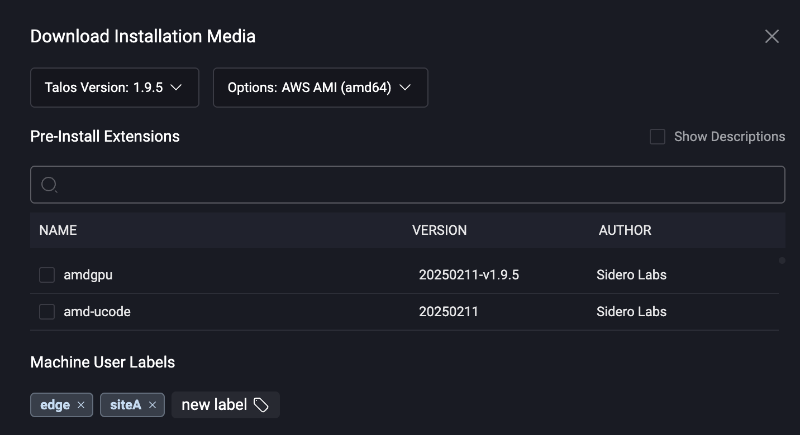

# Expose an HTTP Service from a Cluster

### Enabling Workload Service Proxying Feature <a href="#enabling-workload-service-proxying-feature" id="enabling-workload-service-proxying-feature"></a>

You first need to enable the workload service proxying feature on the cluster you want to expose Services from.

If you are creating a new cluster, you can enable the feature by checking the checkbox in the “Cluster Features” section:

<figure><figcaption></figcaption></figure>

For an existing cluster, simply check the checkbox in the features section of the cluster overview page.

If you are using cluster templates, you can enable the feature by adding the following to the cluster template YAML:

```yaml
features:
  enableWorkloadProxy: true
```

You will notice that the “Exposed Services” section will appear on the left menu for the cluster the feature is enabled on.

### Exposing a Kubernetes Service <a href="#exposing-a-kubernetes-service" id="exposing-a-kubernetes-service"></a>

Let’s install a simple Nginx deployment and service to expose it.

Create the following `nginx.yaml` file:

```yaml
apiVersion: apps/v1
kind: Deployment
metadata:
  name: workload-proxy-example-nginx
  namespace: default
spec:
  selector:
    matchLabels:
      app: workload-proxy-example-nginx
  template:
    metadata:
      labels:
        app: workload-proxy-example-nginx
    spec:
      containers:
        - name: workload-proxy-example-nginx
          image: nginx:stable-alpine-slim
---
apiVersion: v1
kind: Service
metadata:
  name: workload-proxy-example-nginx
  namespace: default
  annotations:
    omni-kube-service-exposer.sidero.dev/port: "50080"
    omni-kube-service-exposer.sidero.dev/label: Sample Nginx
    #omni-kube-service-exposer.sidero.dev/prefix: myservice
    omni-kube-service-exposer.sidero.dev/icon: H4sICB0B1mQAA25naW54LXN2Z3JlcG8tY29tLnN2ZwBdU8ly2zAMvfcrWPZKwiTANWM5015yyiHdDr1kNLZsa0axvKix8/cFJbvNdCRCEvEAPDxQ8/vLSydem+Op7XeVtGCkaHbLftXuNpX8Pax1kveL+UetxY9919erZiWG/k58+/kgvjb7Xonz+Qyn182RP2DZvyjx0OyaYz30x38o8dhemqP43vfdSWi9+DDnCHFuV8O2ksmY/UWKbdNutsPfz9e2OX/pL5U0wghCvqVgqrtTJbfDsL+bzUrhM0F/3MzQGDPjlHIxH9qhaxbrtmueh7d987zbtLvLfDZtz/f1sBWrSj5aD9klhVswwdfWgLNJXR+GL6sgRwSP6QmRd53yELzCCMmRShCjqyFmLOsWwCiIKS01GJOUA0qZHQUby5ZXlsAGjkv8wmuK00A+gDfxoD1DSREQOm0teBdVgOA4wqdY1i0i+AiG4lOGbFEhg7icZWJIgCMz+It1DA/hYDQXScxVjyyohpCprBt7SswylJze49htVNxQjk6xDuSXTAs12OQgUGLWMRenLj4pTsNb11SSde/uPhmbA2U5e6c3qxBiEdhTOhhO77CIwxvJ55p7NVlN1owX+xkOJhUb3M1OTuShAZpQIoK72mtcSF5bwExLoxECjsqzssgIzdMLB2IdiPViApHbsTwhH1KNkIgFHO2tTOB54pjfXu3k4QLechmK9lCGzfm9s0XbQtmWfqa4NB0Oo1lzVtUsx6wjKxtYBcKSMkJOyGzJBbYxBM0aBypZfdBRJyDCz0zNRjXZKw0D/J75KFApFvPVTt73kv/6b0Lr9bqMp/wziz8W9M/pAwQAAA==
spec:
  selector:
    app: workload-proxy-example-nginx
  ports:
    - name: http
      port: 80
      targetPort: 80
```

Apply it to the cluster:

```bash
kubectl apply -f nginx.yaml
```

Note the following annotations on the cluster:

```yaml
omni-kube-service-exposer.sidero.dev/port: "50080"
omni-kube-service-exposer.sidero.dev/label: Sample Nginx
#omni-kube-service-exposer.sidero.dev/prefix: myservice
omni-kube-service-exposer.sidero.dev/icon: H4sICB0B1mQAA25naW54LXN2Z3JlcG8tY29tLnN2ZwBdU8ly2zAMvfcrWPZKwiTANWM5015yyiHdDr1kNLZsa0axvKix8/cFJbvNdCRCEvEAPDxQ8/vLSydem+Op7XeVtGCkaHbLftXuNpX8Pax1kveL+UetxY9919erZiWG/k58+/kgvjb7Xonz+Qyn182RP2DZvyjx0OyaYz30x38o8dhemqP43vfdSWi9+DDnCHFuV8O2ksmY/UWKbdNutsPfz9e2OX/pL5U0wghCvqVgqrtTJbfDsL+bzUrhM0F/3MzQGDPjlHIxH9qhaxbrtmueh7d987zbtLvLfDZtz/f1sBWrSj5aD9klhVswwdfWgLNJXR+GL6sgRwSP6QmRd53yELzCCMmRShCjqyFmLOsWwCiIKS01GJOUA0qZHQUby5ZXlsAGjkv8wmuK00A+gDfxoD1DSREQOm0teBdVgOA4wqdY1i0i+AiG4lOGbFEhg7icZWJIgCMz+It1DA/hYDQXScxVjyyohpCprBt7SswylJze49htVNxQjk6xDuSXTAs12OQgUGLWMRenLj4pTsNb11SSde/uPhmbA2U5e6c3qxBiEdhTOhhO77CIwxvJ55p7NVlN1owX+xkOJhUb3M1OTuShAZpQIoK72mtcSF5bwExLoxECjsqzssgIzdMLB2IdiPViApHbsTwhH1KNkIgFHO2tTOB54pjfXu3k4QLechmK9lCGzfm9s0XbQtmWfqa4NB0Oo1lzVtUsx6wjKxtYBcKSMkJOyGzJBbYxBM0aBypZfdBRJyDCz0zNRjXZKw0D/J75KFApFvPVTt73kv/6b0Lr9bqMp/wziz8W9M/pAwQAAA==
```

To expose a service, **only the `omni-kube-service-exposer.sidero.dev/port` annotation is required**.

Its value **must be a port that is unused** on the nodes, such as by other exposed Services.

The annotation `omni-kube-service-exposer.sidero.dev/label` can be set to a human-friendly name to be displayed on the Omni Web left menu.

If not set, the default name of `<service-name>.<service-namespace>` will be used.

The annotation `omni-kube-service-exposer.sidero.dev/prefix` can be set to use a user-defined prefix instead of a randomly-generated alphanumeric string as a prefix in the URL.

The annotation `omni-kube-service-exposer.sidero.dev/icon` can be set to render an icon for this service on the Omni Web left menu.

If set, valid values are:

* Either a base64-encoded SVG
* Or a base64-encoded GZIP of an SVG

To encode an SVG file `icon.svg` to be used for the annotation, you can use the following command:

```bash
gzip -c icon.svg | base64
```

### Accessing the Exposed Service <a href="#accessing-the-exposed-service" id="accessing-the-exposed-service"></a>

You will notice that the Service you annotated will appear under the “Exposed Services” section in Omni Web, on the left menu when the cluster is selected.

Clicking it will open the exposed service in Omni.

<figure><figcaption></figcaption></figure>

The URL will either contain a randomly-generated alphanumeric prefix, or the user-defined prefix if the `omni-kube-service-exposer.sidero.dev/prefix` annotation was set.


This feature only works with HTTP services. **Raw TCP or UDP are not supported**.


The services are only accessible to users **authenticated to Omni and that have at least`Reader`level access** to the cluster containing the Service.

### Examples

Some common examples include running cluster services such as monitoring that require Omni access.

#### Grafana

Grafana is a popular dashboarding tool that can be installed as a helm chart and exposed with the following values.yaml.

```
service:
  annotations:
    omni-kube-service-exposer.sidero.dev/port: "53000"
    omni-kube-service-exposer.sidero.dev/label: Grafana
    omni-kube-service-exposer.sidero.dev/prefix: grafana
    omni-kube-service-exposer.sidero.dev/icon: H4sICKy0fmgAA2dyYWZhbmFfaWNvbi5zdmcAdVhrj9vGFf3s/RWsggANMKQ4T5IbbwLbaQ0DLVogSL4a61laFsJKC0n7atH/3nvOHUrarQ1jRfLO6z7PPePXPz/+a6rux91+vd1cLWzTLqpxk7c3683qanF3+Fz3i59/unj9p7qu3o+bcXd92O4uqzc3209j9WGa7vYHiirXNrLYVL/+/r76y+Ptdneo/jndreoPm6qh8Hc947JKTdtWb+/W003V/lBVdS3b7+9X50rYRbW+uVr87fpp3H2UD9Fxs79afDkcbi+Xy4eHh+bBN9vdaunatl3K4jLl8nFab/742kQ7DMOSozL1atHePi6qJ31evKoe1jeHL1cLHy3kX8b16stBPlPE5/16fHi7xaKqrWRKJfJFtT88TePVYtxcf5rG+tN1/mO1295tbi4340N1NvNHqna5v73OMv12N+7H3f24gM3YoTo83Yr8MD4elnm/F/mrZn9o//N5PU2Xd7vpz9+J7z788tF+/OHH/168XnKRLF6dO0j+YcPlSn7ExPF69353fbMeNwfOmndYVKsi/m2zPog/70SXX6HYPza/7UdR1Irzu9iIeU/y6tvvReZOMnkdhu+hoyi/va2q7efP+1E81R79AXmdt5MkyXd/beMb1y+W/z/ffn3+23dv2jeY/3r53AyR3F4fvlR5ut7vsUgOFMP+7oMzNtnG5bptUp0aW1t5Wi8vXl4kKYdcu7prujrWNjWuHppQu5jrIM++6WvbYlHXDPiJtUtNf/FK1ojAyze2TPI+yLtMdTmKQLb1NTbzWDe/5NpyFj5tMxgs9amJRo6Efn2NZVamtKKOwztO8hRiPwgTTvEi7DLPl1oQ7eVIaIk9POSdbDGIPKi5ONKpEzBiuV8LIY7EIT1M66AZDetl1fEtY8QbMd9DGEyAjse3PXY0LdWWWbBFpCIItTdQI8iXHAifYV4SgcM8OMaIWupODPUyZI1lpDDEMEDQi4LOeIRDFpgEGwesReRMUBuDEUfAxkjbbA0V+Jvhf1mLmHaiioFp84v62JrQQi0Jn0kRGveyc9fqjjgLvu6MuEkGO6jmml5CZ0XFAbOLPb2uUAvlbFmJwEbRUix9JxN7YwcnW4nPjXP9/MxONjNegmoS9PGxSae33Br519jibD5zEAvggAGOF5WhiZPUyo7nDnJmb7CNZIIcw0hLkiTjoRiiFDE6v2TGVJLFRKSQRZxiD1fKIdnTJvEO1JXnIHvLGdm28kjGwWZEi3tLzOUwxzywJlJnJ2okfE84op0k3vJrIcMvLJpoY5YoeBjSm4CTHOw6vmU7aIlZnlmH05vEFzvIyfSW+gppmVuGAr9JfzGPUn8mHXJgVJEsEXFCDOW03DElB3jYwy8IoaSQ8/SpZpzIUG3wpmwSstMPSVvgg0BOOL1lRR8mVUKhsJRhF2Ktuqn+5Y/livDBThW58z81WP/ll+tKSYgXWPrBsPQlbzAuIcv6rXL4umVh+amV2f1Ez1y84jPmk7eKP6eCKFFfHGc8hxmkZFEovRyYzl+AdIOaiUjQrdAIWgPOMmFxkO0J5T1GLIErC373WA+sk/xJGPU1kijXHTHYciNiIfAfnwp9hFMEYuC2Tsq/5paBaqa6p9oEnwHGTbVmrTohH/NM/RJ1pMPDasbnMsjEp/1wvlXkc8XvgSCaWDMD9EqEQtELENdBawGcDLg3zEPJPqlCtRTIJbAo2CELJVEdLGIGDkRw2SMRix2SGKAlJWvV1UBYBsx4uhwFy4yCSlBGfi3SgTNDVgjqTVnJ0gZYo5gAX8AIUQF/rGb2OgAg9QISJXSTIKd7QKoBuAP84F9OEWTrjKcUAEZok7LMkVhFxLGQdXjJ9C1LrVV9qAk0T7P+LyW1ep/BMrb4gLardWaeHxSWjmNllwLDQ5GmsoMtyN+VcnspxzfMniVOa8J4PgW3mTeBDTSy34ds2T8GmSMlIf0H+wYFLp6PLJFkyMwVdmAwk45axoL5Wvc1054VRYKQNX8JED1t1fxMuaBERzS0RAls3M+tPbJjanPvTOFXfUntVPAFE30pZhbGPMHPJaHiYS6MZzNPoogPCkoQzAm3rdaa04cn9ut3WVigaKYFdHOBoEDgLGwpnthSSwc6xWhIutrPRDA15B7gW2wRBIyO/G8oPIaTsbQnfjCdCW2uIHGgJqAL3Yym1GeGhp6l5876lyX2ujME9oUDpPIcmMzzLr6gOcKUMtJxAJdgjzECGwNoLAsTxxlPg4MBMwN3IJqb0GgzTDSHnAKJBE5Ro5VjtNMmz6yNXGfZPC3z1tMAx6wXbqB9qmDKsTInyyC253WrVIdSP89gvTptTqgN7tEXahlLq7WWICa5Ci5GG+fpttf+HUEipPJE3eyotgeBlKUKNAJdWYuVHNbA01H5TAFAOz/PILIn9HxFIr2cf2WsK4AwzK6Z8TfVip6+cMVhTmQdikBDFkZAFSrTTvS7Z/tEXDqtwlLlhvcOcMPMdAAawEwJzwCa12n/AX8EJ0QXcegWsojQxP2kSaCRODqpq8leo949iBRzu6oB1HbSjJzmJqihPTXLXrlZKXJ7XsEetW5Z+KUJAbwIo7XWJ/MW2ju4kRcgXImsUio00AQKBZ7AGxqURr2ibwalBN4h8aM29sgLnkWXnGlDp8zMsqrJIZC8BAawQJ7OHfVM8IZAJjpzIM8S9YUs6VcijbJnksDfnvI0FYJ6yvpjwad8wkLJ91p7LADGGwWQnpcmq9yQNy5EVqkqfKNdqFMxyUWvNxmUoiXf6WYugZq2MBTl1OlFixdlsCW5oODSKpcUvUqiIEgmlDQ51ibwAXcO7T+4LUfw4PnmhMziKegaqeBDpwnGKwPJo/bOcntKpUMO35Lz3J6wp/3SCSbAXltWuNLXg1H47b4hhz767UuZ8W79YjYujKxQurv/2kiR2xfyMJWej8tPQcLzea7MQ7yGM07mCn7qPeMcPo4j5f4x84wZTVw58cheJhbni/2P+DwVvC4Xzfgcgwl+urojsMWylreR7MqesTwBE22OzE+iMkFCMAe6Z6I0r3PKc4T/WGAQbByIfuSHpI8eSE08j8rW2NgGAqzV26oCyjO5L/L5G+cmvaaSv76U40YbNKZlJJWRQGbrS1tBE03KX2Ee0h+374BCiSTdvBiygZy06o2yNPct+QyKz063RddZ3in3pdxrpzyXU8rrJrWOZIweuubSzWl/P3N0y+ZdSqoY67nY5lN4lVI6Yl7/zgfH0LBMgmO7THDN/N9s/9b/nNvfr366+B/N5a5TOhYAAA==
```

You can then install the grafana chart with:

```
helm repo add grafana https://grafana.github.io/helm-charts
helm install -f values.yaml grafana grafana/grafana
```

#### Kubernetes Dashboard

The Kubernetes dashboard can be deployed via helm into a cluster and exposed with the workload proxy using the following values.yaml.

```
web:
  serviceAnnotations:
    omni-kube-service-exposer.sidero.dev/port: "58888"
    omni-kube-service-exposer.sidero.dev/label: Dashboard
    omni-kube-service-exposer.sidero.dev/prefix: dashboard
    omni-kube-service-exposer.sidero.dev/icon: H4sICHhlYmAAA2xvZ28uc3ZnALVaXW/jypF9n1/B9X1JsCLV3x/yeILFXgQIkKdNFvssS7QtjD4Mih7P3F+fc6qblDyenZtgsQ5yRySb3dVVp06daunjn74e9s2XfjjvTse7G92pm6Y/bk7b3fHx7ua///7nNt0053F93K73p2N/d3M83fzp04eP/9a2zX8O/Xrst83rbnxq/nL8fN6sn/vmD0/j+LxaLl9fX7tdvdmdhsflH5u2/fThw8fzl8cPTdNg3eN5td3c3dQXnl+GvQzcbpb9vj/0x/G81J1e3lyGby7DN1x996XfnA6H0/Esbx7Pv1wNHrYP82ha82plkM45L5VZGtNiRHv+dhzXX9u3r8LGH71qlFJLPLuM/OdGrc5w6DP+Pw+fbnTn08uw6R/wXt8d+3H5699/nR+2qtuO26tpJn++WfWNk4/rQ39+Xm/683K6L++/7rbj091NNKZLzke599TvHp9G3FS6yyHYcne3vbuB8UYuroChy9M66Wp+ojqXOtcMOdssQybrV9vThubc3exPj6ducsg8Q//1+TSM7cNu35dhy6fToV+OT6fN591xeR42y88v9/0Ar2A3x/61ez7+eIqv22d41gXVZa+U/uGYb9+N+YRBH7f9w5mDy6555W6apTyad0Hbtl92/etl4P36XLzaNM/rRyBwfxrubn55kL/64P40bPthehTk782jE6K0G7+VnKtzTzZz1vm5+vHz89N6e3q9uzHfP/ztdDpg1tDprLzK3z/efMU7MXY+JK/fPaQ9Hg+dy+77h4jnC7OyfTnuRiD/+eu711+GgQP26289tv1olZ/MOz+dXh8Heu9hvZ/dN7/5ujtiN22Fqfb6nd11xATaZN5tvI7A/t5vrD7D9oz/X54d1l93h91vPUx85/Dzcf3cPu5P9+v92w087Ea8ODzuju14eobl6v2Dff8w/vjJUPbyo0f3p3GUOKoJkYd+XG/X4/qCw+lOFDRjCPhs9V+//rlc4XqzWf3PafhcL/HHAev70wsWvfk03/643azAQIf1+Gl3ALRIXv8Oxvm4vDx4M3j89txfJi3TDn2hsh/y+XZz2PGl5d/G3X7/Fy5St3U16W7c95ebH5fV+rq35dXmPi6nrcvV43fR2q/ve8Tpr0Rh8w4Kj8Pp5flw2pKYOOLm4lC5nl4Yh/XxzN3f3cjHPYrdH9rQWRNUdmbR6ui66I374+T+x2k/nKuAf97N83p8urjsPH7bY31w3371Cybc9P6WF23N+pW+PY/D6XO/qqxSL0uCrNR0Ca/2wx6wHVduuvf9FO12Da4YhvW31REl/OZiBSHU2OA7q41f6OS6hA/NunGhi8YFoxf4ZJ3B50bJ/7DpLquA4a7zfK3ZN61xDqNsxBygnfg7MxjfGa6zsLrjS81fG0zqFz7nLooB//GT141FAeNSwRa7fzY2dByXYaMOueOaRquy+k9ttKFsbgHDqole2Y7LphC64MPvWOltrm5KLneGE0SVUGWTWI5PnPVnM0Sdikc0XqGTUbm4fmuC6X4vSLOL28nHU5Q4A4NEQ366/ntY/HaFHAKciAbG/fXtuRCcjsd+M56GFiXhy3p8GfoLq74Z+U4FXBf6H48t5d541f148TcVvw674pW3mfgvmHzZc36fRLGL1oawMCAFDAim2TRt6lQMOSxSZ/rWIXlcB0zgRuxM9FlPdxaICDys+9YvVKdtjLZB2TfJ4NKEbB0vEQ5cOsKqgTRUWueF7ozONsg1ELYwiGyq1xxvmY6YMgM2C9/pGBoNBlN5kbmOy41ZaFuwiifGYtEFc0RBrzRAWtA6AgNdCNHyXVpranpwlaBTyFg2B48NQl1iAiC3CzE67I8MuaDYKEyhKk9AnBCA4qIYg+wzmqijEEzQxmIV+DFFThoEw2CcsnULCoouaLg1GKNT00bYERW3nzCxVZgme1l04cFTkmwtbNfekLc7reA0GuecVhZZAm7IGktJ3sgNvgFnam4fVnv4Tx57hWTBDD6ZTOslo7EvISVkqUgnveDcygcsok3nuRGsS6kcuLCuec0aUpILK1rlcuLSXjmduVjIycLegMlhMfYk3uc8RtzHZbOOhutHOCDSZOONT9xkUs7LxHzHTF6wcGJGhHDHuegjTQ5ZRdmzcQq7xPzFODvtCpvJPmWuo0FtjhtPBh/giaBsond1oUWCTKIN+xXcphFri5cSl3aGmNSeRKh8Y4tRIOUCEGJYMA7PRaLWRcVLrVRMTd01r+voHMBYRE7SiI7BeIfc0ri22mJ2JQRmCgO6TgcECxmBnIRjCCJ4F/nntQP2jdSH2CnxE2DpIvbilE66ocWIRUTSpKQSEkMT17rSLPMEnYXBUvAJQAzgwCkJWweUM02TfaaJi12BjZuzAISNdSEqgO0YbKC3QM0qJJAHoZRBzK3JEhAkrC4FhGVBzNa1cm4KzJ1l9iTkCL2esncae7HBMZ1CwXgoqYjk6YAYzTcs3E1O4m6dcXAVAOGzZGDxvSslF4BICt5lZuSsPfGAN1CyEByoIy/EVtyvO3mD/zBDGUXJWTKVigwfKCRGGloqpqpsRApzJhAOKstVgk2kRS38pmUsF5GHCC4vtZc3tXdeXnVR3p2gU2YmcSjtxEmGA2At2p7oSH1KBcla0TM1PQumyNsIv7WNMKTFDMxugDU2oEiugAdSWmWlsBCadiRzpIAvlwLtYk9laY7OUdJLoQRzdELI5Trk3KipmitBJ3lapSTXJnhLno4GRYM3fID5tsDhwkuAl7LWkRaszaAleiAgf4V3YgazW3GoZC13DK6JdQCykBsEL4NsLPmIQAGqQbELwgfrsU4kMch7ZxpyStSaDtYMVyplS+pE0TOhapGab5uGlTAi2xYOWZdQ+hp+0A5eT8wvEG+TZp2pqvjbC5CEeGRGTMQOPzomI/jNMfmUtpIAwA+dZxWsZ00GFxupWTYBPBEJQiwhAwG4yOzWFh8ABuwP7sWUcGy2M3qT1CTUEikNyBhvMYsGv2hOk6okLohgbGJixVbkUmYEEKVZsmMUQ7QgyHYTUUefkoOdyAJWdM2lgiMm2Vo0U04aVZM/Eg0yg8sxpYaiIoHkhbYzfNCYidlTV+hWVYhqERjGx3KZ06Q3rhCqnFzVXKxXhvNcjfIelC4l1gEJdLaz8Ar95ZxAt+rSKmwRnGhYcR0JVzFa8B5qOyuM9sCym3IFUSjaB4wGUQXbUEWZxg35Ckm4YF3NOivkJ0WO1EFSF5QIOLxznmGGbRFljvUBQilpqYSkLOBHGfZ1UiKDA7ZskcBtAKwsA0MGgh3KgKEjSNhAJVG8eVHOWmUJYW2RmGQeecAlIY+85BDsdY7b9eB03xTijyWPalUD6BILK0jZspQgtSyAlhCepmSppxBoRFj4DFaDpwBKT7p2rMnAC9yC3qWWmaLWsIGE6o1EAXQRYhQYWLxA4qWANCOp1Yo5aSb6LNrEGTKUEEss1BpzJ2CAZWz8Yo4L5A1oiOurpLPISXAwNqAge6bIi7JiTUKOE9vJJcfiy/JhmCwRHVYkUkvYUy2xkULXFzoCYyPQESJwQaKOqEFzNrRzOjDhkEFZ0OgT5R1REQWNUFRBbpSa005ZByxo1FoJEBYITGyIi8j4QOG6dEnsWfJwjLeAMUGLaOWqoUwWuIF3POubruSH5e0k4DTzETzJfABEpDIoSnDWdRakRhdaTl2YtmSjEG2wTmbF9lMSwWmMJGfRO2TygkKnGEUnyyYMDWhFOwMoYJfoJVFOoWSTq1DXKnS1GUhZ6q2Bnw3ABSHkeZ0iG44goa/sDVwgA6W8gKcjcYFoleqC/Adxz4qyVJdSR42IA6loJGc2DuBTrGdLbWFpofTEwlQ4aE5YSVhQCCNDkaenhKg2K+yUGWHQBWRmCIZRF3hAcy6LqhR1qboiNzFGiq61C9Ggbi65teKyEHt5qNkhU4FqeahDvhKmQoIIFRalDgWSmQaiKZMT2EWEe9IK7SQWCHrFCNEtoJ5C/s4KeCBSqf2rILk0DMwuS66lqaAKkfYkvdINZCpuyc9WixZHpyB0juoPMQ3uhDtzaR1M0FeCrZ0UGyY2VFGsPFFzPvaB2coQ5Gu4VobtJA3JnsnIW6Bik0rXJG2WY9oZkaAc60VKTMcTfkpFXUvDhgoeDR6mMoaCTmo5PMsXoQ2MZkmT9YSjJ6bATNYl8JzkWXKxbI6CFWnskNjAHtvKWEVJG2w1A30Iao7YwHqfG56YIKGFH8CVWtKg7DZUuoYy0EEKnKH0JwgotDzD5cnftd6KbQgnQiWPHYpvJn5hl8ksZgAHWLm0Fu3cW1CZahY3Nmxo7ti4JEk2J/BL0rqIAmqn7kUxPAUJQGCURt4UJgSpQdHbmS0r07MwoUmjYR4IEYEIlVH4y4CjzdyttVO7JloxpKIItVNJ/IwFtDStGRoVqDRTydfddGaQhXwAPAwRzoVEQHZpcgA2WFrWq44VZZaFAyFhbmAxdmwLli9ns7TFsv1LX8xiYcADUErGSzcCmkDVj1KsME+86sF1nNpcKsGgdKm9SpaCq6WlhEZm1kjiKulRqo5t6zmDrXfQgVlBMFt56mLFHjs6uMNBK7Q8jzDeSYuhCUDCzYtSsNK4WBFlTLAUpbPBDSd0DiTzgGQ6Q2nnUxhWMaBQmn6Qo/RnaE+KlgGAUX2pr0oY4hwG9JlaCltCt0oaA7xErfCM2wElU0vfzgc+PGcppxuYVc6SQFyEDfplqCdUAtFpueoB5awILh1D2Z1iJOln9Dd6PqRq3XRmgFD2reN0KDosZjxPSdSackKGbm0+Mit3mt+ag/BS6TVLeMUBxUkxVDah2wqhl6U20hVSFVMPAfGC52wl3GbqjbUpXd18g8oB6mahRPEHk0UGg1p5GhTnDCnKq5x41TIi+0O9rSznJo2FziejKbN0DD5Bi6OfdnLWRU9b8psCzKMpQGttrsFAYqI7L/omGSVdKZwWhI0Ujxe1v1gkBtFbth5gYw+iaqGI0CNgwWzQhQR8QA1HEmSqJjg8RfG3k2PnvewBV26G0aWVZaXcSEa46KQ38qyPRISFXLE8e3E8j5dDvso/9WwuosIYXkPFMMsNu7Ao2IBQsKJrJgBfObc4s1beggVX7I1UKnBSOcFfeF1Wqq8UNMBaEjrPVCjIodXZSzioJAm5idnVI08YPNvJ1hL6RgnM0OeoRDmCtk8qW5XcRRLvrxakt6ItB6gs3kIV7Hoo96xj86YpnSzKObMbaIoWItXoUvmzryDkNtHbVNKve9+AsT3bXM2+BsKbDXVm27EwqPXgBSe6o5ykhqrDMFaB6aSFYdPd8LzWAVMCO/rDloLncn1jTzKTGjDFfwpBdShdIFlO3tfKiZBAmaJUgYmeR3VtniqWrn082cgokeY8MZfTPDSXhryntYEb3NQohUrX+wt/TEmNYJdDjCJhKh7UdDJZ14IsKN/uqGY6fr/SDgyPqRrLFPWtp/nlxiTdCq34crxa3+CK0RfEhZKw5UQCf6W3RvUApKCWvRxX2cziXPqCqXztm0Ia87ZiqO4qdCSnfOywvXyHBhnMYz4ed2ATCwDD8dRSvjEqE+N9P50XAgxVK+i5baNjF4Wp5DASYPZswdkRZzl/Qk8ixB7RKFftT/4t1Ao5QKCJlIzKaaqLqGrjlSOI3pXzT2rWdAmMifOJ35yMgEyUQz5ofnbxit9O8aBUeyOHtOX0p4JRUKP59QNA46nhWbjQDUBklWQvJT5Ox6UXqV7jzdwQrpiKN4wCHVLR8UtJJ6WTXx1m9oDO8gwJTEvfTvVU+iXH2aMciGkztRdv6w3P4pzXJaze8UQCvhH9bpEmpoJyYlRxUphaFiuxTJiGHZtzhfSik7xAyyxOBPmzq5/OXaezaQ8JpOVUAB1Dw9OAEMnFOlqdKUlTaaGqg0rf09hYfQUiKrggE6M7ozxCj2uZxRBkKi9Ew1b5V8+1a7oAi4GnYkFqJbIlyGGbEbp16PPbNO/blfpiaw4H+beZ6FN2bkykEuZRvoMDMas3PN8C5YC0IwtgLa/h/XeW03fup+PYnne/9atDv929HG7LDT5cHflbh32582U97NbH8c29V/nxyZtb53Hox83TdG/sv47t7rjt8aYqV+v97vG4Oo/rYSw3tv3mNKzH3ekoX8jf7nfHvv6uZZpm349jP7T8Jdfu+DjdfT0N2+/vyYzzTxXKhNvd0G9k/v043N7vT5vP7fNwehz6M3+ztRrvb1+H3YhZWv4OYrUfWtwqxh43T6ehWsvfOYlx56fdw7iaLm/lV02rX5T83ZYfMdSfKfwrP2JAvP8Pv2O4PayHz/1QPn/ZnXf3uz2Hy8c9nXB+3mPs7ig2n770w8P+9Do/749r/NPerzef+YuQ43a13mxeDi/8mUcJ7cP6sNt/W/0Nvr1tp++J2xL1536ze9htShQ54hpo80/H4Fz+6uV8d7Opf+fyn/O5fpzuzRfXt86X8d+PPl9P9v3b72c8X/33/d/b4fPVP/V1fbecvhP/f/zW/uPysfzsB/985K+TPn34ByiQtmK5KgAA
```

You can then install the kubernetes dashboard chart with:

```
helm repo add kubernetes-dashboard https://kubernetes.github.io/dashboard
helm install dashboard -f values.yaml kubernetes-dashboard/kubernetes-dashboard
```

### Troubleshooting

You can get more info and troubleshoot the exposed services by running the following command:

```bash
omnictl get exposedservices
```

You will get an output like:

```
NAMESPACE   TYPE             ID                              VERSION   PORT    LABEL    URL                                                           ERROR                                                             HAS EXPLICIT ALIAS
default     ExposedService   talos-default/nginx-1.default   2         12345   nginx    https://myservice1-omni.<omni-url>                                                                                              true
default     ExposedService   talos-default/nginx-2.default   2         12346   nginx2   https://myservice2-omni.<omni-url>                                                                                              true
default     ExposedService   talos-default/nginx-3.default   2         0                                                                              requested alias "myservice2" is already used by another service   false
```

Inspect the output to get information about the status of your exposed service.
