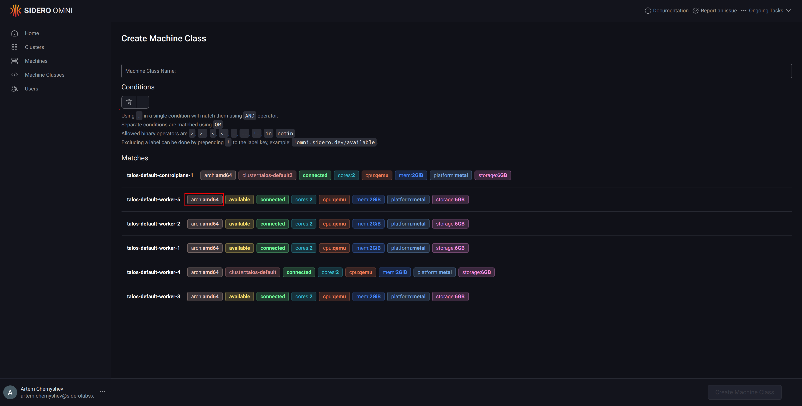
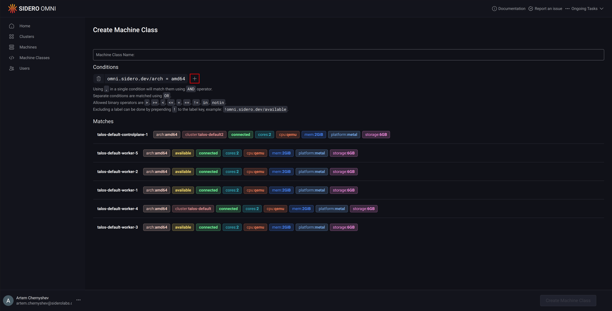
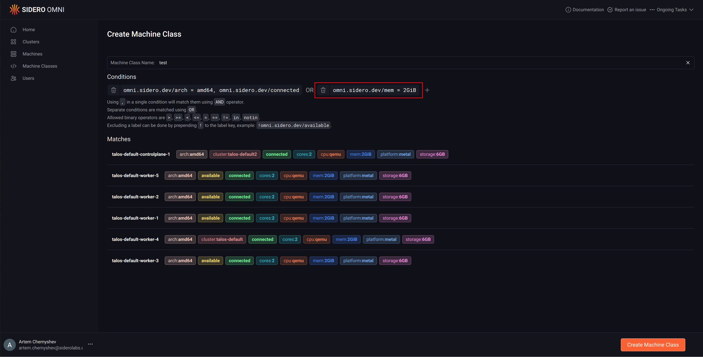

# Create a Machine Class

This guide shows you how to create and a machine class.



Create a file called `machine-class.yaml` with the following content:

```yaml
metadata:
  namespace: default
  type: MachineClasses.omni.sidero.dev
  id: test
spec:
  matchlabels:
    # matches machines with amd64 architecture and more than 2 CPUs
    - omni.sidero.dev/arch = amd64, omni.sidero.dev/cpus > 2
```

Create the machine class:

```bash
omnictl apply -f machine-class.yaml
```



First, click the “Machine Classes” section  in the sidebar on the left

Next, click the “Create Machine Class” button on the right.

Add machine query conditions by typing them manually in the input box.

<figure><figcaption></figcaption></figure>

Clicking the label in the machine list will add them to the input box.

<figure><figcaption></figcaption></figure>

Clicking on “+” will add blocks to match the machines using boolean `OR` operator.

<figure><figcaption></figcaption></figure>

<figure><figcaption></figcaption></figure>

Name the machine class, then click “Create Machine Class”.


