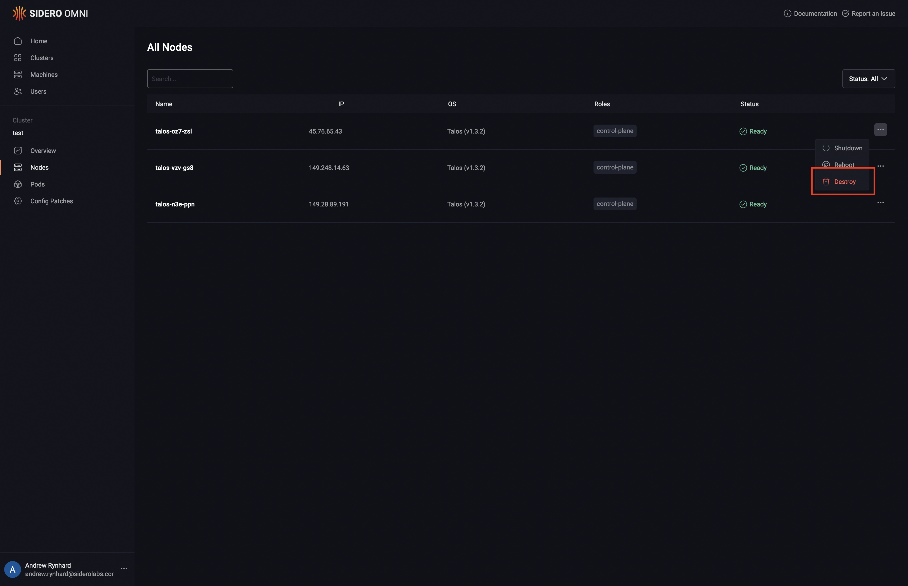

# Scale a Cluster Up or Down

#### Scaling Down or removing nodes from a cluster 

To delete machines in a cluster, click the “Clusters” menu item on the left, then the name of the cluster you wish to delete nodes from. Click the “Nodes” menu item on the left. Now, select “Destroy” from the menu under the elipsis:

<figure><figcaption></figcaption></figure>

The cluster will now scale down.

#### Scaling Up or adding nodes to a cluster 

To add machines to a cluster, click the “Cluster” menu item on the left, then the name of the cluster you wish to add nodes to. From the “Cluster Overview” tab, click the “Cluster Scaling” button in the sidebar on the right.

From the list of available machines that is shown, identify the machine or machines you wish to add, and then click “ControlPlane” or “Worker”, to add the machine(s) with that role. You may add multiple machines in one operation. Click “Add Machines” when all machines have been selected to be added.

The cluster will now scale up.
