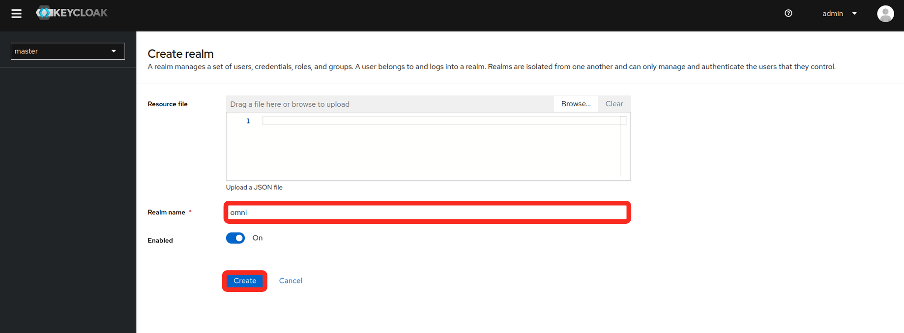
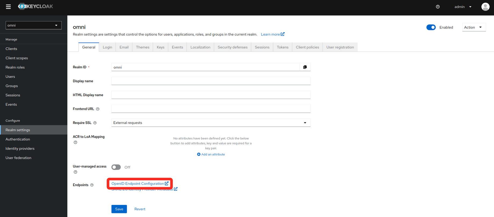
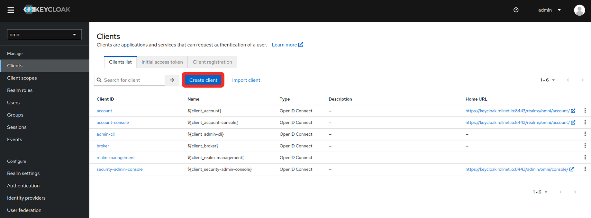
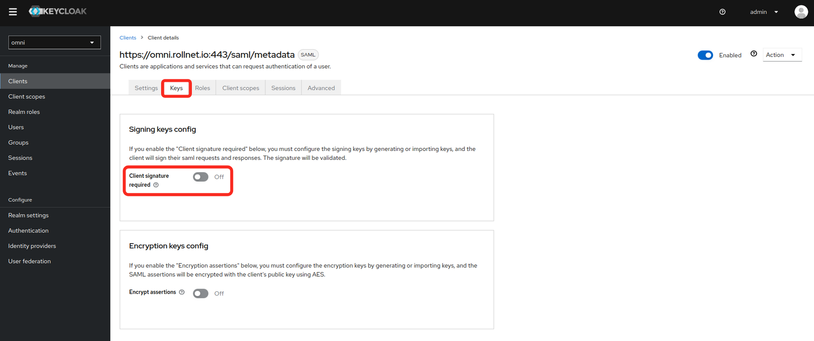
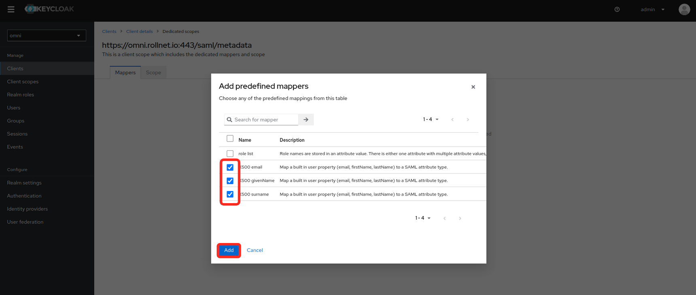

# Configure Keycloak for Omni

1. Log in to Keycloak.
2. Create a realm.

* In the upper left corner of the page, select the dropdown where it says **master**

<figure><figcaption></figcaption></figure>

* Fill in the **realm name** and select **create**

<figure><figcaption></figcaption></figure>

3. Find the realm metadata.

* In the realm settings, there is a link to the metadata needed for SAML under Endpoints.
  * Copy the link or save the data to a file. It will be needed for the installation of Omni.

<figure><figcaption></figcaption></figure>

4. Create a client

* Select the **Clients** tab on the left

<figure><figcaption></figcaption></figure>

* Fill in the **General Settings** as shown in the example below. **Replace the hostname in the example with your own Omni hostname or IP**.
  * Client type
  * Client ID
  * Name

<figure><figcaption></figcaption></figure>

* Fill in the **Login settings** as shown in the example below. **Replace the hostname in the example with your own Omni hostname or IP**.
  * Root URL
  * Valid redirect URIs
  * Master SAML Processing URL

<figure><figcaption></figcaption></figure>

* Modify the **Signature and Encryption** settings.
  * Sign documents: **off**
  * Sign assertions: **on**

<figure><figcaption></figcaption></figure>

* Set the **Client signature required** value to **off**.

<figure><figcaption></figcaption></figure>

* Modify **Client Scopes**

<figure><figcaption></figcaption></figure>

* Select **Add predefined mapper**.

<figure><figcaption></figcaption></figure>

* The following mappers need to be added because they will be used by Omni will use these attributes for assigning permissions.
  * X500 email
  * X500 givenName
  * X500 surname

<figure><figcaption></figcaption></figure>

* Add a new user (optional)
  * If Keycloak is being used as an Identity Provider, users can be created here.

<figure><figcaption></figcaption></figure>

* Enter the **user information** and set the **Email verified** to **Yes**

<figure><figcaption></figcaption></figure>

* Set a password for the user.

<figure><figcaption></figcaption></figure>

***
