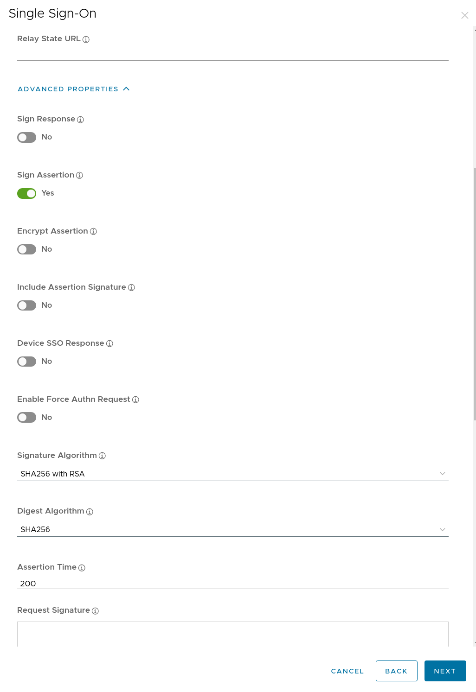
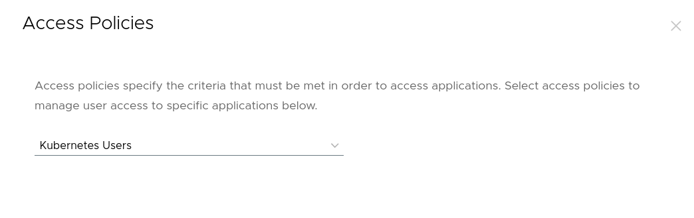

# Configure Workspace ONE Access for Omni

Workspace ONE Access

This section describes how to create a _Web App_ inside Workspace ONE Acces (WSOA).

First, login to the WSOA user interface and browse to _**Resources -> Web Apps -> New**_

<figure><figcaption></figcaption></figure>

Next, enter values for the following options before clicking on _Next_.

| Option      | Value       | Description                              |
| ----------- | ----------- | ---------------------------------------- |
| Name        | Omni        | A descriptive name for the Web App       |
| Description | Sidero Omni | A description for the Web App            |
| Icon        | Image       | An icon to be displayed on the dashboard |

<figure><figcaption></figcaption></figure>

On the _**Single Sign-On**_ page, enter the following values:

| Option              | Value                               | Description                                       |
| ------------------- | ----------------------------------- | ------------------------------------------------- |
| Authentication Type | SAML 2.0                            | The Authentication type. Options are SAML or OIDC |
| Configuration       | Manual                              | We will use manual to specify the fields          |
| Single Sign-On URL  | `https://{omni-host}/saml/acs`      | The SSO URL for Omni                              |
| Recipient URL       | `https://{omni-host}/saml/acs`      | The Recipient URL for Omni                        |
| Application ID      | `https://{omni-host}/saml/metadata` | The Omni metadata URL                             |
| Username format     | Unspecified                         | The username format is unspecified                |
| Username value      | `${user.userName}`                  | The username sent in the SAML assertion           |
| Relay State URL     | Blank                               | Leave this empty                                  |

<figure><figcaption></figcaption></figure>

Still on the _**Single Sign-On**_ page, in the _**Advanced Properties**_ section, set the following toggle buttons;

| Option                      | Value            | Description                      |
| --------------------------- | ---------------- | -------------------------------- |
| Sign Response               | False            | Sign the SAML response.          |
| Sign Assertion              | True             | Sign the SAML assertion.         |
| Encrypt Assertion           | False            | Encrypt the SAML assertion.      |
| Include Assertion Signature | False            | Include the assertion signature. |
| Device SSO Response         | False            | Enable Device SSO response.      |
| Enable Force Authn Request  | False            | Enable Force Authn Request.      |
| Signature Algorithm         | SHA-256 with RSA | The signature algorithm.         |
| Digest Algorithm            | SHA-256          | The digest algorithm.            |
| Assertion Lifetime          | 200              | The assertion lifetime.          |

<figure><figcaption></figcaption></figure>

At the bottom of the _**Single Sign-On**_ page, in the _**Custom Attribute Mapping**_ section, add the following attributes:

| Name      | Format      | Namespace | Value               | Description              |
| --------- | ----------- | --------- | ------------------- | ------------------------ |
| email     | Unspecified |           | `${user.email}`     | The user’s email address |
| firstName | Unspecified |           | `${user.firstName}` | The user’s first name    |
| lastName  | Unspecified |           | `${user.lastName}`  | The user’s last name     |
| groups    | Unspecified |           | `${groupNames}`     | The user’s groups        |

<figure><figcaption></figcaption></figure>

Click _**Next**_ to continue and select the access policy as required by your organization.

<figure><figcaption></figcaption></figure>

Now it’s time to click the _**Save & Assign**_ button and permit the Users and Groups allowed to login to Omni.

<figure><figcaption></figcaption></figure>

On the _**Assign**_ screen, enter the following:

* Select the permitted group from your backing Active Directory or LDAP server.
* Set the _**Deployment Type**_ to _**Automatic**_.

<figure><figcaption></figcaption></figure>

Finally, obtain the _**IdP**_ Metadata URL by clicking on _**Settings**_ and then the _**Copy URL**_ link.

<figure><figcaption></figcaption></figure>


This is the URL that will be used by Omni in the command line arguments in the next section.


<figure><figcaption></figcaption></figure>

### Omni <a href="#omni" id="omni"></a>

Provide the following flags to the Omni container on launch.

| Flag                                             | Description                                                                                                       |
| ------------------------------------------------ | ----------------------------------------------------------------------------------------------------------------- |
| `--auth-saml-enabled`                            | Enable SAML authentication.                                                                                       |
| `--auth-saml-url`                                | The URL to the IdP metadata file.                                                                                 |
| `--auth-saml-label-rules='{"groups": "groups"}'` | This extracts the `groups` attribute from the SAML assertion into the label `saml.omni.sidero.dev/groups/<value>` |

For example;

Copy

```bash
--auth-saml-enabled=true
--auth-saml-url=https://{workspace-one-host}/SAAS/API/1.0/GET/metadata/idp.xml
--auth-saml-label-rules='{"groups": "groups"}'
```

Now that you have started Omni with the correct flags, refer to the [Auto-assign roles to SAML users](https://omni.siderolabs.com/docs/how-to-guides/how-to-auto-assign-roles-to-saml-users/) guide for information on how to automatically assign roles to users based on their SAML attributes.

Note that when using groups, the group name is prefixed with `saml.omni.sidero.dev/groups/` instead of role. For example;

Copy

```yaml
metadata:
  namespace: default
  type: SAMLLabelRules.omni.sidero.dev
  id: assign-admin-to-platform-admins-label
spec:
  assignroleonregistration: Operator
  matchlabels:
    - saml.omni.sidero.dev/groups/omni-platform-administrators
```

\
