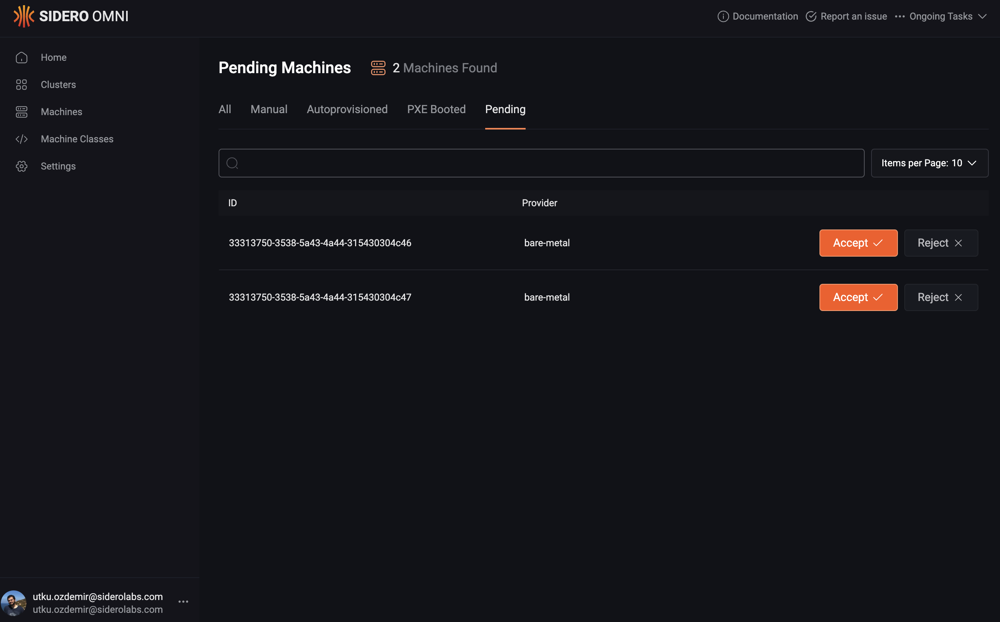
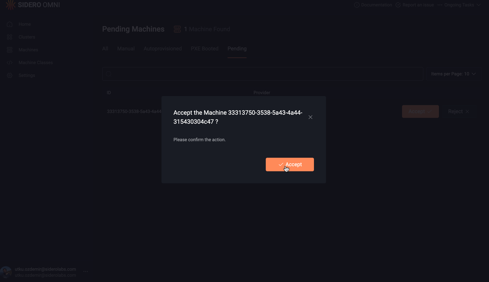

# Setting Up the Bare-Metal Infrastructure Provider

In this tutorial, we will set up a [Bare-Metal Infrastructure Provider](https://github.com/siderolabs/omni-infra-provider-bare-metal) service for our Omni instance to be able to provision bare metal machines.

## Requirements

* An Omni instance (either on the Sidero Labs SaaS or self-hosted) with Admin access
* Access to the [Image Factory](https://factory.talos.dev) (either the public one hosted by Sidero Labs, or self-hosted)
* Some bare-metal machines with:
  * BMC (baseboard management controller) power management capabilities via one of the following:
    * IPMI
    * Redfish
  * Outbound access to the Omni instance and the Image Factory
* A machine/container/cluster etc. in the same subnet as the bare-metal machines, in order to run the infrastructure provider service

In this tutorial, we will assume:

* Our managed Omni instance is running at `my-instance.omni.siderolabs.io`&#x20;
* We will use the public Image Factory at `factory.talos.dev`
* Bare-Metal machines with IPMI support
* An additional server with Docker installed to run the infrastructure provider service, with the IP address `172.16.0.42` within the subnet `172.16.0.0/24`, reachable by the bare-metal machines
* Two bare-metal servers within the subnet `172.16.0.0/24` with access to the infrastructure provider, our Omni instance, and to the Image Factory

## 1. Creating an Omni service account

We start by creating an Omni service account for the infrastructure provider to authenticate/authorize to Omni.


Here, we need to create the service account with the same ID as the ID of the provider service we are going to run. It defaults to bare-metal, hence we use it as the name, but if you plan to use a different ID ([passed via `--id`](https://github.com/siderolabs/omni-infra-provider-bare-metal/blob/v0.1.0-alpha.0/cmd/provider/main.go#L96)) or run multiple provider instances, set the name accordingly for the service account.




Navigate to the _Settings - Service Accounts_ tab on the Omni web UI, and create a service account with ID `bare-metal`

<figure><figcaption></figcaption></figure>

Store the displayed service account key securely for later use.



Using `omnictl`pointing to your instance `my-instance`,  run the following command:

```bash
omnictl serviceaccount create --use-user-role=false --role=InfraProvider infra-provider:bare-metal
```

It will output the Omni endpoint and service account key:

```
OMNI_ENDPOINT=https://my-instance.omni.siderolabs.io
OMNI_SERVICE_ACCOUNT_KEY=eyJu...LS0ifQ==
```

&#x20;Store them safely for later use.



## 2. Starting the provider

We will run the provider in a Docker container in our server with IP `172.16.0.42`.


The provider requires its following ports to be accessible:

* `50042`: HTTP and GRPC API port, customizable via `--api-port`)
* `69`: TFTP port used to provide iPXE binaries to PXE-booted machines


Start by getting the image reference of the latest version of the [provider package](https://github.com/siderolabs/omni-infra-provider-bare-metal/pkgs/container/omni-infra-provider-bare-metal).

At the time of writing, it is `ghcr.io/siderolabs/omni-infra-provider-bare-metal:v0.1.0`, and this is what we shall use in this tutorial.

Set the required environment variables, using the service account key from the previous step:

```bash
export OMNI_ENDPOINT=https://my-instance.omni.siderolabs.io
export OMNI_SERVICE_ACCOUNT_KEY=eyJu...LS0ifQ==
```

Run the following command to start the provider service:

```bash
docker run -d --name=omni-bare-metal-infra-provider \
--restart=always \
--network host \
-e OMNI_ENDPOINT \
-e OMNI_SERVICE_ACCOUNT_KEY \
ghcr.io/siderolabs/omni-infra-provider-bare-metal:v0.1.0 \
--api-advertise-address=172.16.0.42
```

Make sure it is running by checking its status:

```bash
docker ps | grep omni-bare-metal-infra-provider
```

Sample output:

```
7190a326decf   ghcr.io/siderolabs/omni-infra-provider-bare-metal:v0.1.0   "/provider --api-adv…"   About a minute ago   Up About a minute    omni-bare-metal-infra-provider
```

Start tailing its logs in a separate shell:

<pre class="language-bash"><code class="lang-bash"><strong>docker logs -f omni-bare-metal-infra-provider
</strong></code></pre>

Sample output:

```json
{"level":"info","ts":1734439242.1502001,"caller":"provider/provider.go:80","msg":"starting provider","options":{"Name":"Bare Metal","Description":"Bare metal infrastructure provider","OmniAPIEndpoint":"..."}
{"level":"info","ts":1734439242.1973493,"caller":"ipxe/handler.go:310","msg":"patch iPXE binaries","component":"ipxe_handler"}
{"level":"info","ts":1734439242.2833045,"caller":"ipxe/handler.go:316","msg":"successfully patched iPXE binaries","component":"ipxe_handler"}
{"level":"info","ts":1734439242.2870164,"caller":"provider/provider.go:221","msg":"start component","component":"COSI runtime"}
{"level":"info","ts":1734439242.28702,"caller":"provider/provider.go:221","msg":"start component","component":"TFTP server"}
{"level":"info","ts":1734439242.287044,"caller":"provider/provider.go:221","msg":"start component","component":"DHCP proxy"}
{"level":"info","ts":1734439242.2870617,"caller":"provider/provider.go:221","msg":"start component","component":"machine status poller"}
{"level":"info","ts":1734439242.2870378,"caller":"provider/provider.go:221","msg":"start component","component":"server"}
```

At this point, the provider has started and established a connection to our Omni instance.


The provider can manage the power state of machines using either **IPMI** or **Redfish**.

By default, it probes the BMC IP for the Redfish API availability. If Redfish is available, it will be preferred over IPMI.

This behavior can be customized using the following flags:

* To always use Redfish, set `--redfish-use-always`.
* To always use IPMI (not probe Redfish), set `--redfish-use-when-available=false`.

See all Redfish related flags via the `--help` flag.



The provider will start a DHCP proxy server, responding to DHCP requests from the interface that the `--api-advertise-address`resides in. This DHCP proxy server is only responsible for generating PXE-boot responses for the machines configured to PXE boot. It does not affect the existing DHCP infrastructure otherwise.


If you need to run this DHCP proxy on a different interface (so the responses are broadcast to the correct network), you can pass the `--dhcp-proxy-iface-or-ip` flag to the provider, specifying either the name of the network interface or an IP on that machine which belongs to the desired interface.


## 3. Starting the Bare-Metal Machines

At this point, we can boot our bare-metal machines. Before we start, make sure that they are configured to boot over the network via PXE on the next boot, so that they can be booted by the provider.


We recommend using the boot order of first disk, then network.


Power cycle the machines, and when they attempt to boot via PXE, you can see in the provider logs that they have been PXE booted by the provider. Log messages should be similar to the lines below:

```json
{"level":"info","ts":1734440893.9489105,"caller":"dhcp/proxy.go:140","msg":"offering boot response","component":"dhcp_proxy","source":"da:65:8c:d7:c7:81","boot_filename":"tftp://172.16.0.42/undionly.kpxe"}
{"level":"info","ts":1734440898.0781841,"caller":"tftp/tftp_server.go:103","msg":"file requested","component":"tftp_server","filename":"undionly.kpxe"}
{"level":"info","ts":1734440898.1611557,"caller":"tftp/tftp_server.go:123","msg":"file sent","component":"tftp_server","filename":"/var/lib/tftp/undionly.kpxe","bytes":88919}
{"level":"info","ts":1734440900.2585638,"caller":"dhcp/proxy.go:140","msg":"offering boot response","component":"dhcp_proxy","source":"da:65:8c:d7:c7:81","boot_filename":"tftp://172.16.0.42/undionly.kpxe"}
{"level":"info","ts":1734440900.317854,"caller":"ipxe/handler.go:97","msg":"handle iPXE request","component":"ipxe_handler","uuid":"cef9a5ee-71b7-48f1-8ce3-daf45e7be0a0","mac":"da-65-8c-d7-c7-81","arch":"i386"}
{"level":"info","ts":1734440900.3258681,"caller":"ipxe/handler.go:260","msg":"boot agent mode using image factory","component":"ipxe_handler"}
{"level":"info","ts":1734440902.685483,"caller":"server/server.go:110","msg":"request","component":"server","method":"GET","path":"/ipxe","duration":2.367639908}
```


At this point, these machines are booted into a special mode of Talos Linux called "_Agent Mode_". In this mode, Talos:

* does not detect any existing Talos installation on the disk, nor attempt to boot from disk
* does not allow a configuration to be applied to it
* establishes a secure [SideroLink](https://www.talos.dev/v1.9/talos-guides/network/siderolink) connection to the Omni instance
* runs the [Metal Agent](https://github.com/siderolabs/extensions/tree/v1.9.0/guest-agents/metal-agent) extension which establishes a connection to the provider
* runs the only the required services to be able to further provisioned by the provider


## 4. Accepting the Machines

At this point, the machines should be booted into the Agent Mode, and have established a SideroLink connection to our Omni instance. Let's verify this:



Navigate to _Machines - Pending_ tab on Omni web UI. You should see the machines pending acceptance:

<figure><figcaption><p>Acceptance Screen</p></figcaption></figure>



Run the following commands:

```bash
omnictl get link;
omnictl get inframachine;
```

The output should look like the following:

<pre><code>NAMESPACE   TYPE   ID                                     VERSION   CONNECTED   LASTENDPOINT
default     Link   33313750-3538-5a43-4a44-315430304c46   5         true
default     Link   33313750-3538-5a43-4a44-315430304c47   5         true
<strong>
</strong><strong>NAMESPACE        TYPE           ID                                     VERSION   PREFERRED POWER STATE   ACCEPTANCE   CLUSTER TALOS VERSION   EXTENSIONS   WIPE ID                                EXTRA KERNEL ARGS
</strong><strong>infra-provider   InfraMachine   33313750-3538-5a43-4a44-315430304c46   3         0                       0                                    []
</strong>infra-provider   InfraMachine   33313750-3538-5a43-4a44-315430304c47   3         0                       0                                    []
</code></pre>



Our machines have the following IDs:

* `33313750-3538-5a43-4a44-315430304c46`
* `33313750-3538-5a43-4a44-315430304c47`

For security reasons, the machines cannot be provisioned in Omni before they are "_Accepted_". We will accept these machines using the Omni API.


The following step will wipe the disks of these machines, so proceed with caution!




Simply click the "Accept" button on each machine under the _Machines - Pending_ tab on the Omni web UI, and confirm the action:

<figure><figcaption></figcaption></figure>



Prepare an `accept.yaml`file with the following contents, setting `.metadata.id` field to the id of the first machine:

```yaml
metadata:
  namespace: default
  type: InfraMachineConfigs.omni.sidero.dev
  id: 33313750-3538-5a43-4a44-315430304c46
spec:
  acceptancestatus: 1
```

Apply this resource to your Omni instance using `omnictl`:

```bash
omnictl apply -f accept.yaml
```

Then replace the `.metadata.id`field with the ID of the second machine and repeat the same step.




Accepting the machine will **wipe ALL disks**



When you do this, the provider will do the following under the hood:

* Ask the Talos Agent service on the machines to configure their IPMI credentials
* Retrieve these credentials and store them
* Wipes the disks of these machines
* Power off these machines over IPMI

Additionally, Omni will create a `Machine`, and an `InfraMachineStatus` resource for each machine. You can verify this by:

```bash
omnictl get machine;
omnictl get inframachinestatus;
```

Output will be similar to:

```
NAMESPACE   TYPE      ID                                     VERSION   ADDRESS                                   CONNECTED   REBOOTS
default     Machine   cef9a5ee-71b7-48f1-8ce3-daf45e7be0a0   4         fdae:41e4:649b:9303:8379:d4b5:cacc:e0bb   true
default     Machine   d3796040-2a28-4e0f-ba1a-1944f3a41dde   4         fdae:41e4:649b:9303:8379:d4b5:cacc:e0bb   true

NAMESPACE        TYPE                 ID                                     VERSION   POWER STATE   READY TO USE
infra-provider   InfraMachineStatus   cef9a5ee-71b7-48f1-8ce3-daf45e7be0a0   3         1             true
infra-provider   InfraMachineStatus   d3796040-2a28-4e0f-ba1a-1944f3a41dde   3         1             true
```

## 5. Adding Machines to a Cluster

We can now create a cluster using these machines. For this, simply follow the guide for [creating a cluster](../how-to-guides/index.md).

When you add these machines to a cluster, the following will happen under the hood.

The provider will:

* Power these machines on, marking their next boot to be a PXE boot
* PXE boot them into Talos maintenance mode

Then Omni will proceed with the regular flow of:

* Applying a configuration to the machine, causing Talos to be installed to the disk
* Reboot (possibly using `kexec`)

The cluster will be provisioned as normal, and will get to the `Ready` status.

## 6. Removing Machines from a Cluster

When you delete a cluster and/or remove some bare-metal machines from a cluster, the following will happen:

Omni does the regular de-allocation flow:

* Remove the nodes from the cluster (leave `etcd` membership for control planes)
* Reset the machines

Afterwards, the provider will follow with these additional steps:

* PXE boot the machine into Agent Mode (to be able to wipe its disks)
* Wipe its disks
* Power off the machine

At this point, these machines will again be ready to be allocated to a different cluster.
